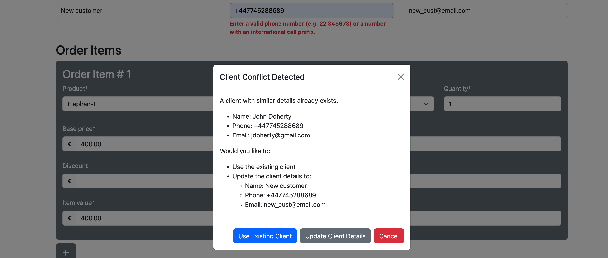
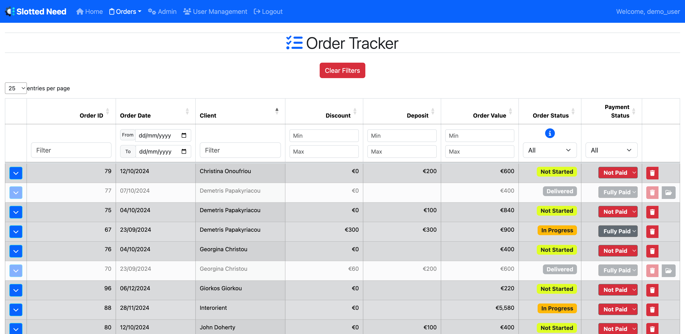
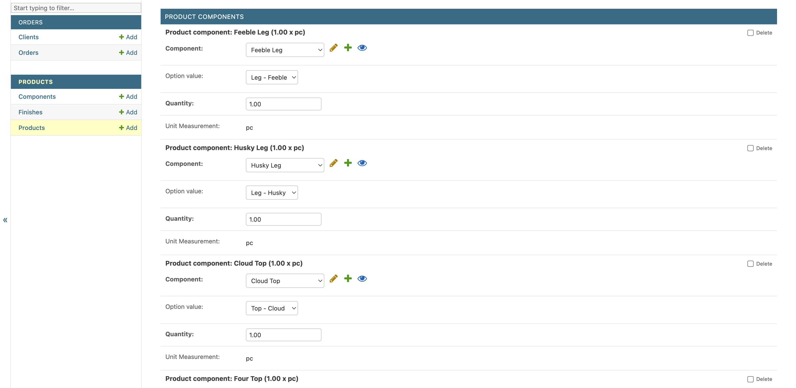
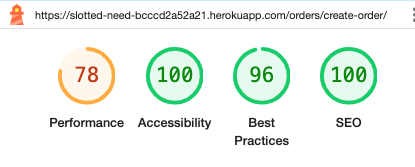
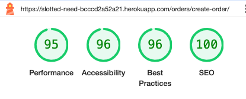

<h1 align="center">SLOTTED NEED - A Product & Orders Management Application</h1>

"Slotted Need" is a Django-based web application developed to simplify the management of products, components, and order configurations for designer products such as designer tables and lamps. This app provides an easy-to-use interface to manage the complex relationships between products, components, options, and finishes, making the entire process intuitive and efficient. The name implies that this application targets the need for a system that facilitates the various components being "slotted" seamlessly between them and interacting to provide a well structured products and orders management application.

<a href="https://slotted-need-bcccd2a52a21.herokuapp.com/">ACCESS THE APPLICATION</a>

# App Overview

## App Purpose / User Goals
The Slotted Need app aims to streamline the management of customised products and orders by offering a comprehensive interface for tracking products, components, and associated configurations. The main goals include:

- **Efficient Product Management:** Provide tools to easily manage complex relationships among products, components, options, and finishes.

- **Streamlined Order Processing:** Simplify order creation and management for internal use.

- **Customisation and Flexibility:** Enable extensive customisation options to meet client-specific needs within the defined product structures.

- **Monitoring Dashboard:** Provide a summary view dashboard portraying key information regarding sales, payments and order fulfillment.

- **Future Features:** Add features like stock & inventory management, automated client communication, component cost monitoring, and enhanced financial/sales data dashboard.

## Key Features

- **Product-Component Relationship Management:** Effectively manage products and their components, accommodating complex product builds with different components and quantities via the app administration page. Accommodate user-driven product builds via the django app admin interface.

- **Dynamic Order Forms:** Use dynamic order forms, to accurately and consistently capture product selections along with their related design options and finishes.

- **Granular Component Tracking:** Track individual components and sub-components (ComponentPart) for each product, including quantities and input costs.

- **Integration of Options and Finishes:** Manage products with multiple options and finishes that adjust dynamically based on the selected components.

- **Order Tracking:** Track and edit order details directly from the order list page, allowing inline editing with live updates to order and payment statuses, or moving completed orders to archive.

- **Order Item Tracking:** Monitor item fulfillment by tracking the item status, priority level and setting items as completed.

- **Order Archive:** Maintain an order archive with completed orders keeping a history of orders over time.

- **Filtering and Sorting Data:** Allow the filtering and sorting of data tables in the order and item trackers to facilitate drilling down and understanding data.

# App Design & Planning

## User Stories
### Must have

| Title | User Story | Acceptance Criteria |
| ----------- | ----------- | ----------- |
Admin user can login on the cloud app to access through authentication | As a User I can login on the cloud app so that I can access the app securely from any device | <ul><li>User can register as admin via email</li><li>User can sign in and sign out</li></ul> |
Add a new component/part | As a user I can add a new component input so that I can use this to populate/assemble a product | <ul><li>Can define a component's name, description, unit cost, unit measurement</li><li>Can edit or remove an existing component</li><li>Can input supplier source details</li></ul> |
Add a new product | As a user I can add a new product so that I can populate orders | <ul><li>Can add/change/delete a new product</li><li>Can link to options for finishes/configuration from the available finish categories</li><li>Can link the product with components/parts available in the system and can define quantity of each component</li><li>Can add/edit a base price for the product</li> |
Can add a category of finishes or configuration | As a user I can add a category of finishes/configurations so that I can options for relevant products | <ul><li>Can add a named category to assign options/items to it</li><li>Can edit/delete categories</li></ul> |
Can add options/items to finishes categories | As a user I can add options/items to the finishes categories so that I can populate the order form with options/configurations for a specific product | <ul><li>Can add options to a set category</li><li>Can edit/delete options</li></ul> |
Can add a new order with one or more items | As a user I can add a new order with one or more products so that I can efficiently log new orders that belong to the same customer | <ul><li>Add a new order with one or more products in the dialog box</li><li>Can delete an item from the order or change quantity</li></ul> |
Can view the totals/subtotals and can apply discount or custom price on order items | As a user I can view and manipulate the prices of order items so that I can have flexibility when submitting an order | <ul><li>Have the price displayed on the modal for each item and subtotal</li><li>Have an order total appear</li><li>Can apply a %ge discount on an order or item or apply a custom price on an item</li><li>Can add a deposit amount pre-paid on order</li> |
Can select predefined products and associated finishes/configs on order form | As a user I can select predefined products and associated finishes/configurations so that I can easily and accurately populated order items | <ul><li>Can select a product from a list</li><li>The associated options for finished/configurations dynamically appear on the order form</li></ul> |
View the full order list and fields | As a user I can view the full orders list so that I can see track and change the order details and fields | <ul><li>Can view the orders list</li><li>Can sort the table/list based on fields</li><li>Can filter the table based on select fields</li></ul> |
Set order status | As a user I can set the order status so that I can keep track of order completion | <ul><li>I can set the order status once an order is submitted</li><li>The order status options: Not started, In progress, Made, Delivered</li></ul> |
Can submit order for managing it later | As a user I can submit an order so that I can manage its progress until its fulfillment | <ul><li>User can submit the order once the order form was filled up as required</li><li>User is notified of success or failure (with reason if failed) once order form is submitted</li><li>The order object is created in the database via the post request</li></ul> |
User is notified appropriately when errors occur with suggested action or details of error | As a user I can be notified with details of an occurring error and/or suggested action so that I can react to errors and be able to report them if possible | <ul><li>Error handling is placed around the codebase with appropriate error pages displaying</li><li>Descriptive enough without compromising security by disclosing sensitive information</li><li>Have an error reporting form that will report issues to the maintaining developer</li> |

### Should have
| Title | User Story | Acceptance Criteria |
| ----------- | ----------- | ----------- |
Maintaining developer can track error logs and receive error reports from users | As a maintainer developer I can review error logs and receive error reports so that I can respond and fix errors and go through error history to understand bugs | <ul><li>When an error occurs it gets logged in an error log history along with the required details: user, time of error, details of error etc</li><li>Can view an error log archived by date and can flag error items as read</li><li>Can receive error reports in email inbox as well as reported on an authorised maintainer view</li></ul> |
Can set an order as complete+paid to move them out to archive | As a user I can set an order as complete & paid so that I can move it out of existing orders into archive | <ul><li>Can click a button next to the order to declare as complete & paid</li><li>The order gets moved out from the order view into archived orders</li><li>User can move archived orders back to existing orders in case of a mistake or changes</li></ul> |
Can add client details to an order on placement | As a user I can add client details on the order placement form so that I can associate orders with clients | <ul><li>Can select a client from the Clientele list by selecting or through dynamic type search</li><li>Can add a new client with contact details if client does not exist</li><li>Can change details of a client selected on the form before submitting the order</li></ul> |
Keep track of clientele list | As a user I can keep track of clients list with contact details so that I can reach out to them when needed or select on order forms | <ul><li>Can add a client to the clientele list including contact details</li><li>Can edit/delete client details</li></ul> |

### Could have
| Title | User Story | Acceptance Criteria |
| ----------- | ----------- | ----------- |
Open an overview with key metrics | As a user I can open a key metrics view so that I can quickly assess the current situation | <ul><li>The view should include "Accrued Revenue" or "Accrued Payments"</li><li>View order items per status: "Orders made and ready for delivery", "Orders not started", "Orders in progress"</li><li>View Payments received in Current Year and Orders Fulfilled in Current Year</li></ul> |
Admin can add other users | As an Admin I can add/revoke other users with specified access privileges so that I can receive help on certain tasks when needed | <ul><li>Admin can add another user using email details</li><li>Admin can revoke a user from access</li><li>Admin can specify section or pages that the user can access</li><li>Admin can change the sectionr or pages that the user has access to</li></ul> |

### Won't have
| Title | User Story | Acceptance Criteria |
| ----------- | ----------- | ----------- |
Can drill down in Accrued revenue to see Debtor balances | As a user I can drill down further into Accrued Revenue so that I can see this amount broken down by client | <ul><li>Can access this view either from the navbar menu or the overview page by clicking on accrued revenue</li><li>This view summarises the amounts owed (or Accrued Revenue) per client, sorted descending on total amount</li></ul> |
Can view stock gaps for order fulfillment | As a user I can see what stock gaps I have so that I can plan for further stock to fulfill orders | <ul><li>Can view the stock gaps relating to components in order to fulfill existing orders</li><li>The stock gaps should flag to the user on a message when logging in or clicking on the stock view</li></ul> |
Generate a pro-form invoice based on order details | As a user I can generate a pro-form invoice based on order details so that I can accurately and easily create invoices | <ul><li>Can edit an HTML invoice template using Rich-text editor</li><li>Can choose to generate an invoice using order details</li></ul> |
Can email a client about an order using a template | As a user I can use an email template filled with order details so that I can easily email a client regarding an order | <uL><li>Can select to email a client regarding an order using an email template</li><li>Can define an email template and placeholders for order values to fill</li><li>Can register an email provider to send the email programmatically</li></uL> |
Can see if components/products are available for a selected product on the order form | As a user I can see if required components or finished products are available when selecting products on the order form so that I am aware before submitting a form | <ul><li>When a user selects a product, the relevant components or finished products stock appears flagging if there is a gap</li><li>The user can submit an order with a stock gap, however a confirmation warning message should appear to confirm</li></ul> |
Define stages of processing required for certain components | As a user I can define the stages of processing required for certain components so that I can then use these stages to track the status on the stock view | <ul><li>Can flag a component as "Processing Required"</li><li>Can define the stages of processing required to populate these in the stock view tracker</li></ul> |
Define processing stage for WIP components that require processing | As a user I can set the processing stage of a component stock item so that I can keep track of the status of components in processing | <ul><li>User can set the status of components e.g. varnished or painted</li></ul> |
Stock numbers get updated when an order is placed | As a user I can rely on the system to update the stock numbers when an order is placed so that I can keep track of my stock needs when new orders come in | <ul><li>When an order is placed, the stock components required are move to a status of "WIP" until the order is completed</li><li>The WIP items are no longer available to fulfill another order and the stock view is updated to show that</li></ul> |
Can view the stock list | As a user I can view the stock numbers per component/product so that I can keep track of stock needs | <ul><li>Have a view of products and component numbers in a tabular format</li><li>See the last time each product/component count was updated</li><li>Can edit the number/count of a line and the last updated date field will be updated automatically</li></ul> |
Can add a stock item (component or product) | As a user I can add a stock item (component or finished product) so that I can update my stock list | <ul><li>Can add a specified number of components from the available components registered in the system</li><li>Can add a specified number of products from the available products registered in the system</li></ul> |
Can keep track of a history of prices for a product | As a user I can view a history/log of prices for a given product so that I can keep track of changes over time | <ul><li>When a new price is initially set, it gets added to the history with the date</li><li>When a prices is subsequently changed, it gets added to the history along with a date and optional comment</li></ul> |
Keep track of a unit cost history of each component | As a user I can view a log of unit cost of a component each time it is changed so that I can keep track of movement over the long term | <ul><li>When a unit cost is first applied, this is added on the history with the date added</li><li>When a unit cost is then changed, this is added on the history along with the date and an optional comment</li></ul> |
Export data from the system in XLS or PDF format | As a user I can export data from the system in an excel or PDF format so that I can fulfill other needs or uses outside the app | <ul><li>Can choose what data to export</li><li>Can choose what format to export it in, between xlsx or pdf files</li></ul> |

## Wireframes
Various hand sketches were made to illustrate possible layouts for the many views in this app. At the design and initial development stage, hands-on meetings were held with the intented primary user (Thalis Nicolaou), to experiment with layouts and design, refining them in an agile process as they were developed.

## Typography & Colours
### Fonts
Default fonts were used with not great emphasis on specific font usage. This is an area that can be further researched in the future to improve styling, however due to the advanced feature complexities and intented use as an internal tool and not a public website, this was deemed as lower priority for the time-being.

### Colour palette
The colour palette is mainly determined by the [Bootstrap 5 background colours](https://getbootstrap.com/docs/5.0/utilities/background/), bg-primary and bg-light colours being more dominant colours accross the app. 

## Database
### Design
#### Entity Relationship Diagram (ERD)
The ERD below was generated using the [graph-models](https://django-extensions.readthedocs.io/en/latest/graph_models.html) django extension which created a .dot file (see [erd_diagram.dot](documentation/erd/erd_diagram.dot)) which was then used by the [dreampuf](https://dreampuf.github.io/GraphvizOnline/) GraphViz generator to generate this diagram.

#### Products app
This is the foundation of the project, as "slotted need" revolves around design products and its configurations that then lead to orders.
- ##### Product model
    
The app's main model, that contains the high-level key information concerning a product, importantly <em>name</em> and <em>base_price</em>.

- ##### Option & OptionValue models
    
These models define the design options that pertain to a product. For example a table might have a "Table Top" option which allows for various design option values such as "Cloud", "Four" or "Pick". At the same time this table could have an option for "Leg Shape" with "Husky" or "Feeble" being the available option values. Product to Option and Option to OptionValue relationships are defined as one-to-many.

- ##### Component, ProductComponent, & ComponentPart models
    
Represents a separately identifiable component of a product e.g. a "Husky Legs" of a table. Product is linked to Component via a many-to-many relationship through the ProductComponent intermediary model. This allows for components to potentially relate to more than one product and vice versa.

    
The ProductComponent intermediary model also captures additional information about the relationship regarding the quantity of the components that are needed to complete the product build. Optionaly, this component can be associated with a specific option value e.g. the "Husky Leg" is linked to the "Husky" option value for "Leg Shape" option. Naturally, essential components that are part the product build irrespective of option selections, will have a null option_value in this intermediary table.

    
A component can also be broken down into granular parts of the component, captured by the ComponentPart model. e.g. a "Husky Legs" can be broken down into "Husky Top Leg" and "Husky Bottom Leg" that together make up a complete component.

- ##### Finish and FinishOption models
    
A finish is some kind of processing applied to the finished product, such as a colour paint or oil varnish. The finish can be applied generally at product-level or more specifically at component-level, captured by the many-to-many relationships with Product and Component.

    
FinishOption provides the selection options for each finish category e.g. "Honest Blue" for colour paint or "Linseed Oil" for oil varnish.

#### Orders app
- ##### Client model
    
Holds key information regarding a customer and has a one-to-many relationship with the Order model, which means a client can have multiple orders for products.

- ##### Order model
    
Defines an order which includes <em>order_status</em>, <em>paid</em> and <em>archived</em> fields to signify the status of the order, amongst other monetary fields. An order contains one or more order items.

- ##### OrderItem model
    
This model captures the link between orders and products, with many-to-one relationships against the Order and Product models. It also holds various status and monetary fields.

- ##### ComponentFinish model
    
This is in place to maintain the link between a component and its associated finish option applied by the order configuration selected.

### Implementation
#### Products app
The products app models were implemented in the [products/models.py](products/models.py) file as follows:
| Model Name | Description | Fields | Custom Methods |
|------------|-------------|--------|----------------|
**Finish** | Represents a type of finish that can be applied to a component or product. | `name` (CharField, max_length=50), `description` (TextField, optional) | None |
**FinishOption** | Represents detailed options available for a specific finish. | `finish` (ForeignKey to Finish), `name` (CharField, max_length=50) | None |
**ComponentPart** | Represents the most granular parts of a component, including cost and quantity. | `name` (CharField, unique), `slug` (SlugField, unique), `description` (TextField, optional), `unit_cost` (DecimalField), `component` (ForeignKey to Component), `quantity` (PositiveIntegerField, default=1) | None |
**Component** | Represents high-level components that make up a product, such as legs or tops. | `name` (CharField, unique), `slug` (SlugField, unique), `description` (TextField, optional), `unit_cost` (DecimalField), `supplier_details` (TextField, optional), `finishes` (ManyToManyField to Finish, optional) | `calculate_unit_cost()`: Calculates total unit cost based on the sum of unit costs of its parts. `save()`: Ensures unit cost is calculated and updated after saving related parts. |
**Product** | Represents the main product that can be ordered, consisting of components and finishes. | `name` (CharField, unique), `slug` (SlugField, unique), `description` (TextField, optional), `base_price` (DecimalField), `components` (ManyToManyField through ProductComponent), `finishes` (ManyToManyField to Finish, optional) | None |
**Option** | Represents additional options available for a product. | `name` (CharField), `product` (ForeignKey to Product) | None |
**OptionValue** | Represents specific values for an option. | `option` (ForeignKey to Option), `value` (CharField) | None |
**ProductComponent** | Acts as an intermediary to link products with components, tracking the quantity used. | `product` (ForeignKey to Product), `component` (ForeignKey to Component), `option_value` (ForeignKey to OptionValue, optional), `quantity` (PositiveIntegerField, default=1) | None |

#### Orders app
The orders app models were implemented in the [orders/models.py](orders/models.py) file as follows:
| Model Name | Description | Fields | Custom Methods |
|------------|-------------|--------|----------------|
**Client** | Represents a customer placing an order. | `client_name` (CharField, max_length=100), `client_phone` (CharField, max_length=20), `client_email` (EmailField), `created_on` (DateField, auto_now_add=True) | None |
**Order** | Represents a customer's order. | `client` (ForeignKey to Client, optional), `discount` (DecimalField), `deposit` (DecimalField), `order_value` (DecimalField), `order_status` (IntegerField), `paid` (IntegerField), `created_on` (DateTimeField, auto_now_add=True), `updated_on` (DateTimeField, auto_now=True), `archived` (BooleanField, default=False) | `calculate_totals()`: Calculates the total discount and order value based on order items. `update_order_status()`: Updates the order status based on the statuses of related items. `save()`: Custom save method to calculate totals and update statuses as needed. |
**OrderItem** | Represents an item in an order, including the product, options, and finishes. | `order` (ForeignKey to Order), `product` (ForeignKey to Product), `base_price` (DecimalField), `discount` (DecimalField, optional), `item_value` (DecimalField), `option_values` (ManyToManyField to OptionValue, optional), `product_finish` (ForeignKey to FinishOption, optional), `item_status` (IntegerField), `priority_level` (IntegerField), `completed` (BooleanField) | `calculate_item_value()`: Calculates the value of the order item based on base price and discount. `update_completed()`: Updates the `completed` status based on item status and order payment status. `save()`: Custom save method to ensure value calculations and completed status updates. `unique_configuration()`: Generates a unique configuration string representing the product, options, and finishes. |
**ComponentFinish** | Represents finishes associated with specific components in an order item. | `order_item` (ForeignKey to OrderItem), `component` (ForeignKey to Component), `finish_option` (ForeignKey to FinishOption) | None |

## Technologies & Tools Stack

This project utilizes a robust stack of technologies and tools to deliver a seamless experience in development and functionality. This stack ensures scalability, maintainability, and ease of development, empowering the project to meet its goals effectively. Below is a breakdown of the key components:

### Programming Languages
- **[Python](https://www.python.org/)**: The core programming language used for backend logic and full-stack application development facilitated by the python-based Django framework (see below).
- **[JavaScript](https://developer.mozilla.org/en-US/docs/Web/JavaScript)**: For dynamic front-end functionality and interactive features.
- **[HTML5](https://developer.mozilla.org/en-US/docs/Web/Guide/HTML/HTML5)**: Structuring web pages with semantic markup.
- **[CSS3](https://developer.mozilla.org/en-US/docs/Web/CSS)**: For styling the front-end and ensuring a responsive design.

### Frameworks
- **[Django](https://www.djangoproject.com/)**: A high-level, batteries-included, Python web framework that enables rapid development and clean, pragmatic design.
- **[Django REST Framework (DRF)](https://www.django-rest-framework.org/)**: For building RESTful APIs, facilitating communication between the frontend and backend.
- **[Bootstrap](https://getbootstrap.com/)**: A front-end framework for developing responsive and mobile-first web interfaces.

### JavaScript Libraries
- **[jQuery](https://jquery.com/)**: Simplifying DOM manipulation and AJAX requests for dynamic user interactions.
- **[Chart.js](https://www.chartjs.org/)**: Generates visually appealing and customizable charts for data visualization.
- **[Moment.js](https://momentjs.com/)**: For parsing, validating, manipulating, and formatting dates.

### Python Libraries
- **[pytest-django](https://pytest-django.readthedocs.io/en/latest/)**: Enables concise, readable, and scalable test configurations for Django projects.
- **[Unittest.mock](https://docs.python.org/3/library/unittest.mock.html)**: Used for mocking during unit testing to isolate and test the email user-invitation process.
- **[Django Model Bakery](https://model-bakery.readthedocs.io/en/latest/)**: Python library: Simplifying the creation of test data for unit tests.
- **[django-phonenumber-field](https://github.com/stefanfoulis/django-phonenumber-field)**: Ensures proper validation and formatting of phone numbers.
- **[crispy-bootstrap5](https://django-crispy-forms.readthedocs.io/en/latest/crispy_tag_forms.html#bootstrap5)**: Simplifies form rendering with Bootstrap 5 styles.
- **[django-allauth](https://django-allauth.readthedocs.io/en/latest/)**: Provides a robust authentication system, including login, registration, and third-party OAuth integration.
- **[django-crispy-forms](https://django-crispy-forms.readthedocs.io/en/latest/)**: Enhances Django forms with DRY (Don't Repeat Yourself) principles and flexible styling.
- **[django-extensions](https://django-extensions.readthedocs.io/en/latest/)**: Adds management commands and additional utilities to ease Django development.
- **[django-filter](https://django-filter.readthedocs.io/en/stable/)**: Provides filtering capabilities for Django querysets, often used with DRF.
- **[django-nested-admin](https://github.com/theatlantic/django-nested-admin)**: Adds nested inline editing functionality in the Django admin interface.
- **[whitenoise](https://whitenoise.evans.io/)**: Simplifies serving static files in production environments.
- **[Coverage](https://coverage.readthedocs.io/)**: For analyzing test coverage in the codebase.

### Tools
- **[Sentry](https://sentry.io/welcome/)**: For real-time error monitoring and debugging in both Python and JavaScript.
- **[Heroku](https://devcenter.heroku.com/)**: Facilitates live deployment of the application, ensuring a scalable and accessible platform.
- **[GitHub](https://docs.github.com/)**: Provides version control, secure code storage, and collaborative tools for development.
- **[Gitpod Enterprise](https://www.gitpod.io/docs/)**: Automates workspace creation directly from the GitHub repository, streamlining development setup.
- **[VS Code Desktop](https://code.visualstudio.com/docs)**: The primary IDE for code editing, debugging, and workspace management, with extensions like Python and PEP8 linters for enhanced functionality.
- **[SendGrid](https://docs.sendgrid.com/)**: For sending transactional emails such as user invitations and notifications.
- **[Google OAuth](https://developers.google.com/identity)**: To enable secure authentication for users via Google accounts.

# Functionality & Features deep-dive
## Home Dashboard
The **Home Dashboard** provides an overview of key metrics and insights for the application. Features include:
- A summary of item statuses and order priorities displayed through interactive charts.
- Key performance indicators (KPIs) such as revenue and outstanding balances.
- A quick-access navigation panel for common management tasks.
- Filters allow for "slicing" of data insights.
- The "Critical Items" data table on the bottom right is a filtered view of the "Order Item Tracker", whereas certain filters are applied to show only items that are considered critical in status. i.e. Paid but Not Started, Delivered but Not Paid or with High Priority Level set.
- An "Edit Items" button opens the Order Item Tracker view with the "critical filter" pre-applied which also allows further editing and filtering within that view. It is the only button that is designed to open in a new tab as it considers better UX to keep the user in the main home view while pursuing further investigation or changes in the critical items. All other navigation buttons in the navbar redirect to the selected view.
- There are API views set up to feed each chart or data table in this view with pre-prepared data.

## Order Management

### Create Order Form
The **Create Order Form** allows users to:
- Add new orders for clients by entering details such as client information, order items, and deposits.
- Dynamically add multiple order items with product selections, options, and quantities.
- Validate form fields and specific client data handling to prevent duplicates or conflicts, using exact and partial match handling.

Notable features deep-dive:
- A client search functionality exists for better UX, whereas the user can find existing users by simply typing and a dynamic dropdown appears as they type for possible matches.

- Client phone is handled using the django-phone-field extension library, which handles regional codes and applies phone-specific validation for international numbers too. If a number has the wrong number of digits for the country/region (determined by the prefix coutry code), a validation error is raised. The default region is Cyprus, therefore when no region code is applied, then it is assumed as +357 which is the Cyprus region code.

- When partially matching client details are detected in the entered client information, a modal appears to notify the user that there is a potential client conflict, giving the options to handle it gracefully. The user can either, use existing client, update client details or cancel. This prevents any potential confusion from client duplicates or clients sharing the same contact information. If completely new client details are entered, then a new client is created and saved in the database automatically.

- Following through an example order submission, after entering the client information, the user can select a product which will dynamically then populate the relevant design options and their associated finish options (if any).

- Once the user selects a design option, in this case for the "Plank" component, the associated finish options then appear. In this case once "Linseed oil" is selected, the other options for "Varnish" are grayed out for better UX, so that it is clearer to the user what has been selected and make the form less "noisy". The "Varnish" option can still be selected however if deciding to change.

- The user then must select the second design option, for the "Base" component in this case, following with the associated finish option (in this case being only "Paint").

- The form allows adding further order items to the order, by clicking the "plus" button, which allows another set of item selections. 

- An item can also be deleted from the order.

- An item can be discounted, which automatically is reflected by the item value (readonly field). The base price is pulled from the database product information, but can be however edited by the user to allow flexibility. The total order value is a readonly field which automatically reflects the sum of the item values in the order. The deposit is an optional field.

- Finally if the form passes all validation and required fields, the user is notified of the successful order submission.

### Order Tracker view
The **Order Tracker View** enables users to:
- View and manage all active orders and their items, categorized by their status and priority levels.
- Inline edit specific order/item details and statuses for real-time updates.
- Delete or archive orders.
- Filter and sort orders by various attributes, such as paid status and due date.

Notable features deep-dive:
- Order items are neatly grouped and nested in a sub-table, that works like a dropdown when the toggle button is pressed. This allows further management of the items status and priority levels with real-time updates.

- The order items' status determines what the order status is, based on certain rules. If for example at least one item is in progress, then the order status is also set as in progress (like the example above). Once **all** items are set to delivered, then the order status changes automatically to delivered, as seen below. Additionally if an order is both delivered and fully paid, then the order is greyd out and an archive button appears, which allows the user to move it to the order archive. For better UX, spinners appears when the AJAX patch calls are in process, to give feedback to the user when the changes are updated in the backend.

- Once the user decides to archive the order, they can do so by clicking the archive button. Like Order #94 in this example, the order is then moved out of the view and to the order archive.

- A user can sort the table by clicking on a column heading (the little arrows show which column is sorting, in this case client field).

- Can also apply one or more filters to investigate the orders. All filters can be cleared via the clear filters button.

### Order Archive view
The **Order Archive View** allows users to:
- Manage archived orders, including restoring or permanently deleting records.
- Maintain a clean active orders list by transitioning completed or old orders to the archive.

Notable features deep-dive:
- The example Order #94 from above can be seen in the order archive table. This order can also be un-archived by clicking the yellow un-archive button. This will move it back to the order tracker.

### Item Tracker view
The **Item Tracker View** provides detailed insights into:
- Individual order items and their current statuses.
- Critical item tracking, highlighting items marked as urgent or delayed.
- Dynamic filtering and search for easier navigation, with the focus on order item fulfillment.

Notable features deep-dive:
- As the hovered-over tooltip below indicates, there are a few fields that require a bit more complex filtering, such as the Component Finishes field, that allows a mix of comma separated values to filter on component, finishes or both.

- A special on/off filter allows hiding of completed items (i.e. delivered and fully paid) to keep the item list cleaner. This filter is set on by default. Below it is unset that shows items with a green tick being marked as complete.

- As mentioned above in the home view, critical items are those that either are paid but not started, delivered but not paid or marked as high priority. The critical items filter indicates how many there are and when pressed filters to show only those.

- Payment status is determined at order level not item level. However the payment status of the relevant order is displayed in the item tracker and allows the user to click on the payment status to make changes, without the need to switch to the order tracker to do so. An example is below where the payment status is set to fully paid, as well as seeing the full order details associated with this item.

## Admin Portal
### Product Build Management
The **Product Build Management** system supports:
- Defining and managing product builds, including their components, finishes, and configuration options.
- Assigning costs and tracking inventory for components and their sub-components, laying the foundations for future enhanced features in cost and stock tracking.
- Streamlined product setup for order creation with the allowed flexibility and dynamic population of options.

Notable features deep-dive:
- The built-in django administration page is utilised to offer an intuitive product building process. As seen below, for an admin user but not a superuser, the admin page is limited to the essential parts relating to Order and Product apps. This is done via an Admin Group controlling permissions. The admin base template was also modified to insert a navigation button (top-right) allowing users to return back to home, for a better UX.

- The use of nested and inline admin django extensions allows for an intuitive product build experience and accurate associations of Design options with specific component and associated finishes, to allow what we see at the order creation level. Components can be associated with design options (hence being optional) while other are essential part of the product build in any case. The depth of this product build structure is done with the idea of expanding the application to allow integrating stock management of components and costing at component or component-part level.

- Finishes are created normally before any products and can be reused accross products. An example finish being "Paint" below.

- Components are also expected to be created before any products (but can still be created on the main product admin page) and can be reused accross products if applicable. Selected finishes can be associated with a component to determine what is shown in the order creation form. Unit cost and unit of measurement fields allow for future costing and stock management integration.

## User Access Management
### Access Privileges
The application enforces strict role-based access:
- Admin users can manage all system data, including orders, products, and users.
- Regular users have restricted access based on their roles, without access to admin page and product builds.

### Logging In/Out
- Secure login/logout functionality for all users.
- Authentication integrates with the Django Allauth library for easy account management and Google authentication option.

### Add/Invite, Edit or Delete Users
Admins can:
- Add new users by filling in the required details via a simple form. An email is sent to the invited users asking them to setup their account.
- Edit or delete existing users (non-admin users only). Only a superuser app administrator can edit or delete admin users.
- Send invitation emails to new users with instructions for account activation and password setup. An inviation can be resent once expired.

## Future Features
The following features are planned for future development to enhance the functionality and user experience of the application:

- **Advanced Order and Item Management**:  
  - Enable editing of item configurations directly from the item tracker.  
  - Drill down into accrued revenue charts to view detailed debtor balances.  

- **Stock Management Enhancements**:  
  - Introduce a stock list view to monitor inventory levels.  
  - Add functionality to view stock gaps for order fulfillment.  
  - Allow the addition of stock items (components or products).  
  - Automatically update stock numbers when an order is placed.  

- **Enhanced Client and Order Communication**:  
  - Generate pro-forma invoices based on order details.  
  - Send templated emails to clients about their orders.  

- **Product and Component Tracking**:  
  - Indicate the availability of components/products for a selected product in the order form.  
  - Define and track processing stages for components and work-in-progress (WIP) items.  

- **Historical Data Tracking**:  
  - Keep a record of product price histories.  
  - Maintain a history of unit costs for each component.  

- **Data Import/Export**:  
  - Import legacy data or Export system data in XLS or PDF format for reporting and offline use. 

## Development & Deployment
### Agile development process
This project follows an **Agile development process**, emphasizing iterative progress, frequent feedback, and adaptability. Key aspects of the workflow include:
- **Scrum-based sprints**: Short development cycles to deliver functional increments.
- **Daily standups**: Regular check-ins to discuss progress and address roadblocks.
- **Issue tracking**: Managed through tools like GitHub Issues or Trello for task prioritization and monitoring.
- **Continuous Integration (CI)**: Automated testing and code quality checks ensure reliability at every stage.

### Deployment to Heroku
The application is deployed on **[Heroku](https://www.heroku.com/)**, a cloud platform that simplifies the deployment and scaling of web applications. 

### How to deploy

  - Log in to Heroku.
  - Create a new application in Heroku.
  - Select "New" and then "Create new app".
  - Name the app, choose a region, and click "Create app".
  - Navigate to the "Settings" tab at the top.
  - In the "Reveal Config Vars" section, enter the environment variables required by the app:
    - KEY: PORT, VALUE: 8000.
    - DATABASE CREDENTIALS (URL & KEY)
    - SENDGRID API KEY
    - GOOGLE OAUTH API KEY
  - In the buildpacks section, click "Add buildpack" and choose Python.
  - Ensure your project includes a Procfile with the necessary commands to run the application.
  - Add a runtime.txt with the required Python version (closer to the compatible Heroku versions).
  - Run database migrations.
  - Go to the "Deploy" tab at the top.
  - Under "Deployment Method", select "GitHub" to connect the two.
  - Click "Connect" to link to the desired GitHub repository.
  - Deploy the required branch.
  - If desirable, subsequent deployments can be handled automatically whenever changes are pushed to GitHub, by enabling "Automatic Deploys" (with CI optional).

### How to clone

- Navigate to this GitHub repository: https://github.com/dimispapa/slotted-need
- Click on the 'Code' button at the top right, then select 'HTTPs'.
- Copy the URL provided.
- Open VS Code, create a new project folder, and open the terminal.
- In the terminal, type "git clone", paste the copied URL, and press 'Enter'.
- This will start the cloning process.

# Testing & Monitoring
## Automated Testing

The Slotted-Need application includes a comprehensive suite of automated tests to ensure robustness and reliability. These tests are divided into multiple modules, each targeting specific views, APIs, and functionalities.

### Test Modules

#### **1. `test_home.py`**

- **Purpose**: Tests the Home view and related APIs for rendering and data accuracy.
- **Highlights**:
  - Verifies the correct template (`home.html`) is used and necessary context variables (e.g., item status, priority levels) are passed.
  - Ensures unauthorized access to the home view and APIs is denied.
  - Validates API responses for product revenue, debtor balances, and item status configurations against expected results.

#### **2. `test_orders_view.py`**

- **Purpose**: Tests the functionality of the `OrderViewSet` and the associated order tracker page.
- **Highlights**:
  - Ensures the `orders.html` template is rendered correctly with required context variables.
  - Tests list, retrieve, update, and delete endpoints for orders.
  - Validates the functionality for dynamically updating order statuses when an order item's status changes.

#### **3. `test_order_items_view.py`**

- **Purpose**: Tests the `OrderItemViewSet` and its related tracker view.
- **Highlights**:
  - Confirms the `order_items.html` template renders correctly and computes critical item counts.
  - Verifies CRUD operations for `OrderItem` objects, including updates to priority levels and item statuses.
  - Ensures APIs correctly return order item lists and details.

#### **4. `test_order_archive_view.py`**

- **Purpose**: Focuses on testing the archive and unarchive actions for orders.
- **Highlights**:
  - Ensures the archive view (`archive.html`) renders with necessary data.
  - Tests the ability to archive and unarchive orders via API endpoints.
  - Validates error handling for invalid archive/unarchive requests (e.g., non-existent order IDs).

#### **5. `test_order_form.py`**

- **Purpose**: Tests the Create Order form and its related view.
- **Highlights**:
  - Ensures the `create_order.html` template renders with the correct forms.
  - Validates form submissions with valid and invalid data, including error handling for duplicate clients, email mismatches, and invalid order item data.
  - Tests the client conflict resolution logic for exact and partial matches.

#### **6. `test_user_views.py`**

- **Purpose**: Tests user management views, including create, update, delete, and invite resend functionalities.
- **Highlights**:
  - Verifies the user list, creation, update, and deletion views render and function correctly.
  - Tests permissions to ensure non-admin users cannot access admin-only views.
  - Mocks and validates the `resend_invite` functionality to ensure invitation emails are sent as expected.

#### **7. `test_user_forms.py`**

- **Purpose**: Validates the custom user forms for creating and updating users.
- **Highlights**:
  - Ensures the `CustomUserCreationForm` handles valid and invalid data, including mismatched emails and duplicate email errors.
  - Tests the `CustomUserChangeForm` to ensure non-admin users cannot modify restricted fields like `is_staff`.
  - Confirms form submissions via the `user_create` view correctly save users and assign them to the appropriate groups.

### Test Framework and Libraries

- **Django TestCase**: Core testing framework for the application.
- **Model Bakery**: Efficiently creates mock database objects for testing.
- **Unittest Mock**: Used for mocking functionalities like email sending.
- **REST Framework Status Codes**: Validates the correctness of API response statuses.
- **Regex Assertions**: Ensures proper formatting for fields like color strings in API responses.

### Coverage

The tests cover a wide range of functionalities, including:
- View rendering and template correctness.
- Context variable inclusion.
- API CRUD operations and data validation.
- User and order management workflows.
- Permissions and access control.

These automated tests ensure the Slotted-Need application functions as intended, reduces regression risks, and maintains a high standard of reliability.

### Test Coverage

The test coverage of this application was analyzed using the `coverage` library. A coverage of 87% of the codebase was achieved through automated testing, which is complemented by thorough manual testing. Below is a summary of the coverage report:

## Manual Testing
To complement the automated tests, thorough manual testing was conducted for the Slotted-Need application to validate its functionalities and ensure a seamless user experience. Below is a breakdown of the manual testing process based on key features and views:

### Home Dashboard
- **Tested Features**:
  - Verified interactive charts display accurate metrics (e.g., item statuses, revenue).
  - Ensured data filters apply correctly to refine insights.
  - Confirmed that the "Critical Items" table shows relevant data and navigates to the Item Tracker view with the critical filter pre-applied.
  - Checked navigation buttons redirect correctly, with the "Edit Items" button opening a new tab.
- **Edge Cases**:
  - Verified empty or no critical items display an appropriate message.
  - Ensured responsiveness and functionality on different devices.

### Create Order Form
- **Tested Features**:
  - Verified dynamic dropdowns populate design options and finish options based on product selection.
  - Ensured client conflict handling works as expected for exact and partial matches, including modal interaction.
  - Tested validation errors for missing or invalid data (e.g., incorrect phone number format).
  - Checked dynamic addition and deletion of order items, including automatic calculations for discounts and total value.
- **Edge Cases**:
  - Entered a very high number of order items to ensure form handles large data gracefully.

### Order Tracker View
- **Tested Features**:
  - Verified orders and items display correctly in the table, with expandable nested items.
  - Ensured inline edits for item statuses and priorities reflect in the database.
  - Checked sorting and filtering functionality, including clearing filters.
  - Tested archiving completed orders and their removal from the active list.
- **Edge Cases**:
  - Tried concurrent updates to ensure data consistency.
  - Checked UX feedback during asynchronous updates (e.g., spinners).

### Item Tracker View
- **Tested Features**:
  - Verified item status updates and critical item highlighting.
  - Tested complex filtering scenarios, such as filtering by specific component finishes.
  - Ensured the "Hide Completed Items" toggle functions correctly.
  - Checked payment status updates through modals without switching views.
- **Edge Cases**:
  - Simulated scenarios with no matching items for applied filters.
  - Tested behavior when many items are marked critical.

### Order Archive View
- **Tested Features**:
  - Confirmed archived orders display in the table with appropriate status.
  - Tested unarchiving functionality to move orders back to the active tracker.
  - Verified deleting archived orders removes them permanently.
- **Edge Cases**:
  - Checked navigation between archive and tracker views for smooth transitions.
  - Verified handling of large volumes of archived orders.

### Product Build Management
- **Tested Features**:
  - Verified intuitive product creation and management through the Django admin interface.
  - Tested nested configurations for components, options, and finishes.
  - Ensured accurate cost and inventory tracking fields are populated.

### User Access Management
- **Tested Features**:
  - Confirmed role-based access controls prevent unauthorized actions.
  - Verified user login/logout functionality.
  - Tested user invitations, updates, and deletions.

### General Error Handling
- Verified graceful handling of errors, such as form validation errors and missing data.
- Checked logging of errors in the backend for debugging purposes.

### Summary
The manual testing process ensures all critical and edge-case scenarios are validated, complementing the robust automated test suite. This combination provides confidence in the stability, usability, and reliability of the application.

## Code Validation
### HTML

HTML files were validated using the recommended [HTML W3C Validator](https://validator.w3.org). Due to authentication required to access the pages, the rendered source code from the browser was used as a direct input in the validator to yield the test results.

| Page    | Screenshot                                                       | Notes           |
| ------- | ---------------------------------------------------------------- | --------------- |
| Home   |    | Pass: No Errors. |
| Create Order |  | Pass: No Errors. |
| Order Tracker |  | Pass: No Errors. |
| Item Tracker |  | Pass: No Errors. |
| Order Archive |  | Pass: No Errors. |
| Item Tracker |  | Pass: No Errors. |
| User Management |  | Pass: No Errors. |
| Add New User |  | Pass: No Errors. |
| Edit User |  | Pass: No Errors. |
| Delete User |  | Pass: No Errors. |
| Login |  | Pass: No Errors. |
| Logout |  | Pass: No Errors. |
| 404 |  | Pass: No Errors. |
| 403 |  | Pass: No Errors. |
| 400 |  | Pass: No Errors. |
| 500 |  | Pass: No Errors. |

### CSS

The CSS stylesheet was validated using the recommended [W3C CSS "Jigsaw" Validator](https://jigsaw.w3.org/css-validator).

| File      | Jigsaw URL | Screenshot | Notes | 
| --------- | ---------- | ---------- | ----- | 
| style.css | [Jigsaw](https://jigsaw.w3.org/css-validator/validator?uri=https%3A%2F%2Fslotted-need-bcccd2a52a21.herokuapp.com%2Fstatic%2Fcss%2Fstyle.7a4365cd9d54.css&profile=css3svg&usermedium=all&warning=1&vextwarning=&lang=en) |  | Pass: No Errors. | 

### JavaScript

The JavaScript scripts were validated using the recommended [JSHint Validator](https://jshint.com/).

| File      | Screenshot | Notes |
| --------- | ---------- | ----- |
| dashboard.js  |  | Pass: No errors. | 
| order_form.js |  | Pass: No errors. |
| client_search.js |  | Pass: No errors. |
| order_form.js |  | Pass: No errors. |
| order_tracker.js |  | Pass: No errors. |
| item_tracker.js |  | Pass: No errors. |
| order_archive.js |  | Pass: No errors. |
| utils.js |  | Pass: No errors. |

### Python

All Python code was validated real-time as soon as they were written, adhering to PEP8 standards, through the use of VS Code extensions "autopep8" and "Flake8". Any issues were highlighted in the IDE's "PROBLEMS" ribbon and dealt with immediately. This was deemed more efficient than validating python code at the end, due to the sheer number of python backend scripts existing in the codebase.

A select code can be tested with [PEP8-CI Python Linter](https://pep8ci.herokuapp.com/).

### Lighthouse Audit

A test was carried out on the deployed website, for the relevant areas using the Lighthouse Audit tool within Chrome Dev Tools. There are some low performance scores which is expected in data-heavy pages that involve AJAX API calls and rendering of charts and data tables.

| Page             | Size    | Screenshot                                                        | Notes               |
| ---------------- | ------- | ----------------------------------------------------------------- | ------------------- |
| Home             | Mobile  |  | No major problems. Some colour choices were maintained for stylistic purposes despite being highlighted as accessibility warning. |
| Home             | Desktop |     | No major problems. Some colour choices were maintained for stylistic purposes despite being highlighted as accessibility warning.   |
| Create Order           | Mobile  |     | No major problems   |
| Create Order           | Desktop |    | No major problems   |
| Order Tracker           | Mobile |    | No major problems. Some colour choices were maintained for stylistic purposes despite being highlighted as accessibility warning.   |
| Order Tracker           | Desktop |    | No major problems. Some colour choices were maintained for stylistic purposes despite being highlighted as accessibility warning.  |
| Order Item Tracker           | Mobile |    | No major problems. Some colour choices were maintained for stylistic purposes despite being highlighted as accessibility warning.   |
| Order Item Tracker           | Desktop |    | No major problems. Some colour choices were maintained for stylistic purposes despite being highlighted as accessibility warning.  |
| Order Archive         | Mobile |    | No major problems. Some colour choices were maintained for stylistic purposes despite being highlighted as accessibility warning.   |
| Order Archive           | Desktop |    | No major problems. Some colour choices were maintained for stylistic purposes despite being highlighted as accessibility warning.  |
| User Management         | Mobile |    | No major problems. |
| User Management        | Desktop |    | No major problems. |

## Error Logging

The **Slotted Need** application uses Django's built-in logging framework to track and manage errors and warnings in both development and production environments. The logging configuration ensures that errors are captured and handled appropriately through various handlers. Here's a breakdown of the logging setup:

- **Console Logging**: In development mode, debug and warning messages are displayed in the console for real-time visibility.
- **File Logging**: A file-based logging system is used to store warnings and errors in a `logs/app.log` file for reference and troubleshooting. This helps in debugging issues that may not be immediately visible in the console.
- **Email Notifications**: Critical errors are sent to the application's administrators via email using a customized `AdminEmailHandler`. This ensures that urgent issues in production are addressed promptly.

### Benefits
- Provides visibility into application behavior during both development and production.
- Maintains a history of logs for postmortem analysis.
- Alerts administrators to critical issues, reducing downtime.

## Error Monitoring with Sentry

In addition to Django's logging system, **Sentry** is integrated into the application for comprehensive error monitoring and tracking. Sentry is configured for both backend (Django-Python) and frontend (JavaScript) error reporting in production.

### Features of Sentry Integration:
- **Real-Time Error Tracking**: Captures and displays errors as they occur in production, providing insights into the root cause.
- **Contextual Information**: Automatically includes stack traces, user data, and request context in error reports.
- **JavaScript Error Tracking**: Frontend issues, such as runtime JavaScript errors, are logged, ensuring a seamless debugging process for client-side code.
- **Alerts and Notifications**: Configured to send alerts for specific error types, ensuring developers can act swiftly on critical issues.

### How It Works
- **Django-Python Integration**: Sentry captures server-side exceptions and logs them to a centralised dashboard.
- **JavaScript Integration**: Sentry's JavaScript SDK is included in the frontend, tracking browser errors and reporting them with full stack traces.

By combining Django's logging with Sentry's advanced monitoring capabilities, **Slotted Need** ensures robust error detection and quick resolution, enhancing application reliability and user satisfaction.

## Fixed Bugs

Errors and bugs were encountered in development, that were logged as issues on the GitHub project until resolution. The following bugs were **fixed**. There are **no** current known bugs.

| Issue             | Description | Closing Comment  |
| ----------------- | -------- | ------------------- |
| Finishes replaced when a new option is selected #31  | When an option is selected, the associated finishes are rendered but then when a second option is selected, its associated finishes overwrite the previous finishes instead of adding them over.| Issue rectified by changing the method javascript is using and the general structure of the template/html |
| Issue with total price calculated wrongly when base_price is edited #32  | The item value and total price of the order is calculated wrongly when the base price is edited. The discount and quantity fields though are ok.| Bug is now fixed as javascript function updateOrderValue is now also refactored as well as corrected |
| Order tracker status style does not update #35  | An error occurs in the updateStatusStyle JS function when changing a status dropdown, the colour does not update.| Fixed: Issue was with event object passing implicitly when triggered from event. Refactored code so that we can handle event triggers more gracefully and use separate functions for on initial load process. |
| Order tracker page 500 error when saving #36  | When attempting to save all changes in the order tracker, it throws a 500 internal server error. Error says: Reverse for 'orders' not found. 'orders' is not a valid view function or pattern name.| Error fixed. Caused by not aligning the view function name when redirecting below, when the name was changed in the url pattern. |
| Issue with order tracker + archive body of tables misaligned with header #38  | On desktop view, both table bodies are misaligned from their headers. Item tracker seems to not have that issue.| Issue was apparent only in the order tracker and archive tables, due to the smaller amount of columns that meant the table did not expand enough to take up the horizontal space and align properly, while the item tracker had enough columns to mask the issue. Fixed it by apply width: 100% on the header and body elements as well as the table to avoid margins being added or fixed width being applied by table settings. |
| Issue with pagination on item tracker #39  | Identified bug when switching to view up to 10 items in the table (resulting to a second page) then DataTables threw an error. Possible bug in other two tables too. Need to investigate further and test pagination as not yet tested enough. Also to test filtering and how it behaves with pagination. Can add automated testing if possible.| Fixed by assigning length to a 'page_size' query parameter and a pagination class (inheriting PageNumberPagination DRF class) with page_size_query_param set to 'page_size' |
| Javascript issue with looping event listeners #47  | An issue was discovered in the JS code of the trackers (data tables), whereas the event listeners are added/fired with exponential loops, causing unexpected results and even fatal error.| issue resolved by removing listeners code outside the callback function of the data tables initialization. |

# Credits
## Technical
| Source                                        | Use                       | Notes                                                  |
| --------------------------------------------- | ------------------------- | ------------------------------------------------------ |
| [Conventional Commits](https://www.conventionalcommits.org/en/v1.0.0/#summary) | Version Control | Help write Git commit messages |
| [GraphModels](https://fontjoy.com/) | Font Pairing | Used to generate font combinations |
| [Django Documentation](https://docs.djangoproject.com/en/5.0/) | Extensive research in concepts/extensions around Forms, Admin, APIs, Logging, Authentication, Templating, Filtering, Serializers, URLs, Testing and more! |  |
| [jQuery AJAX](https://api.jquery.com/jQuery.ajax/) | Use of asynchronous AJAX calls to fetch data from API real-time | Very useful accross the views, for data tables and chart rendering, as well as real-time database CRUD operations |
| [AJAX sourced data tables](https://datatables.net/manual/ajax) | More info on use of AJAX for DataTables |  |
| [Medium.com](https://ahmedyasin487.medium.com/mastering-querying-in-django-a-comprehensive-guide-to-the-q-object-31d50a66524e#:~:text=What%20is%20the%20'Q'%20object,to%20create%20more%20complex%20queries.) | Understanding querying further in Django | |
|[Django REST framework](https://www.django-rest-framework.org/tutorial/quickstart/)| Understanding the use of DRF to build intuitive and powerful APIs viewsets that work nicely with filters and serializers | |
| [Adamj.eu](https://adamj.eu/tech/2020/06/15/how-to-unit-test-a-django-form/) | Understanding further how to test forms |  |
| [Query optimisation](https://medium.com/@ericmoss08/optimizing-queries-in-django-rest-framework-7100525904d7) | Extremely useful to improve performance due to the complex models | also helped fix N+1 query issues from sub-optimal queries of related tables/fields
| [Stack overflow](https://stackoverflow.com/questions/39478482/how-to-create-development-branch-from-master-on-github) | Github branching to use dev branch as staging | Encouraged by my mentor Rory to look into using this feature |
| Code Institute | Using the very useful Django "cheatsheet" for setting up and general django commands |  |

## Content
| Source | Use | Notes | 
| ---- | ---- | ----|
| [FontAwesome](https://fontawesome.com/) | Icons | For buttons |
| [Flaticon](<a href="https://www.flaticon.com/free-icons/digital-transformation" title="digital transformation icons">Digital transformation icons created by Freepik - Flaticon</a>) | Icons | Cogs Icon/Logo |

# Acknowledgements
* I would like to thank my Code Institute mentor, Rory Patrick Sheridan, for the support, very useful advanced tips in terms of testing coverage, github management and comprehensive reviews/testing during this project.
* I would like to also thank Thalis Nicolaou, for giving me the opportunity to create the **Slotted Need tool** based on his business' products/needs, with the aim of rolling this out in production for his operational benefit following the submission of this project.
* Also thanks to my partner, Georgina Christou, and my friends Stelios Kyprou and Marios Ellinas for logging in as users and testing from their devices to ensure that everything is working as expected.
* I would also like to thank Code Institute for the great Django course content that inspired me to go out there and research further to build on my skills!